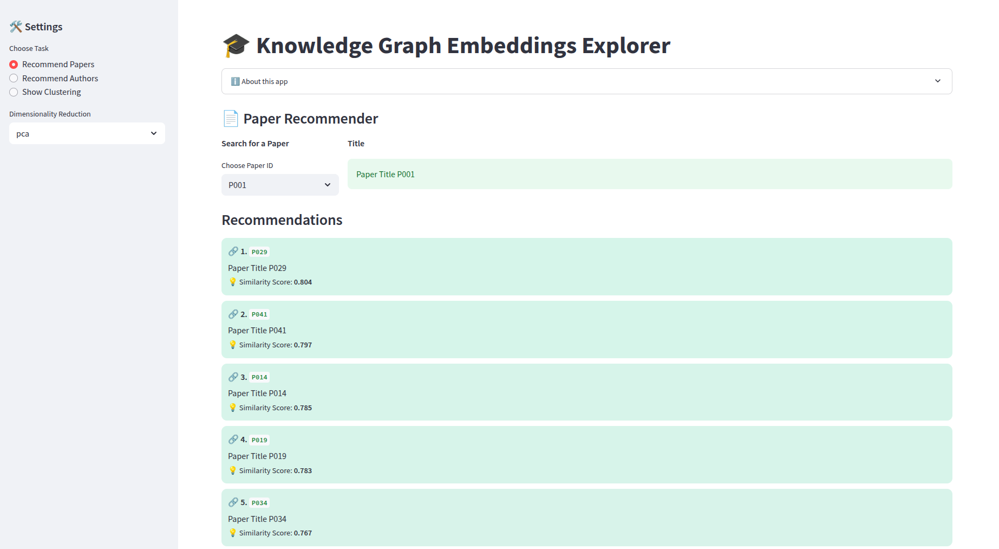
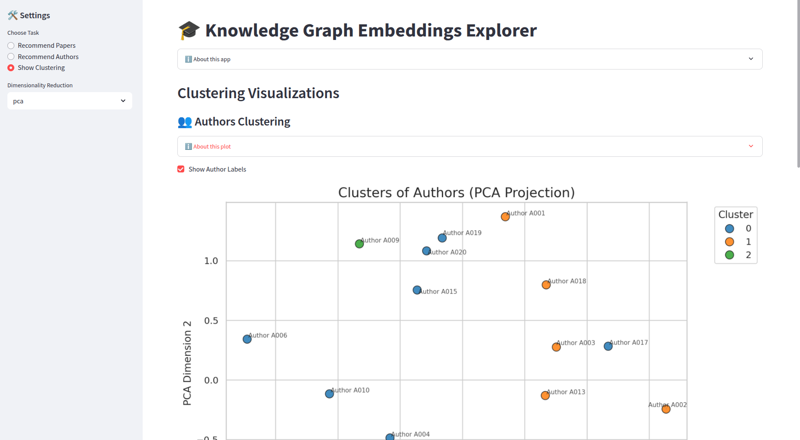

# Knowledge Graphs Embeddings Explorer

## Description 

This project consists of the creation of a knowledge graph for capturing the domain of scientific publications (papers, authors, publication venues...), creating embeddings through different KGE models and using them for further machine learning downstream analytical tasks such as paper recommendation, author recommendation and author and papers clustering through different dimensionality reduction techniques such as UMAP, PCA, T-SNE...





## Structure
```bash
📁 KnowledgeGraphs/
├── 📁 data/: Some data fragments of GraphDB
├── 📁 docs/: Documents and resources
├── 📁 models/: Embedding models 
├── 📁 queries/: SPARQL commonly used queries
├── 📁 src/:
│   └── embeddings/: KG. Embedding related scripts and interactive notebooks
│   └── ontology/: ABOX/TBOX definition and querying
│   └── orchestrator.py/: Execute everything sequentially (Driver)
├── 📄 README.md
├── 📄 requirements.txt
```


## Usage 

### Knowledge Graph 

In order to interact with the knowledge graph we provide SPARQL statements through python wrappers in `src/ontology`. 

```
pip install -r requirements.txt
```

### ML Application and Dashboard

To visualize and interact with the final ML dashboard and gather analytic insights about publications and authors, one can execute  after executing the previous section by simply:

```
streamlit run src/embeddings/application.py
```

This will start the Streamlit UI Web application on the local machine : http://localhost:7777


## Credits
- Walter J. Troiani 
- Iván Martínez (sr) Yates

## License

See previous section for further information